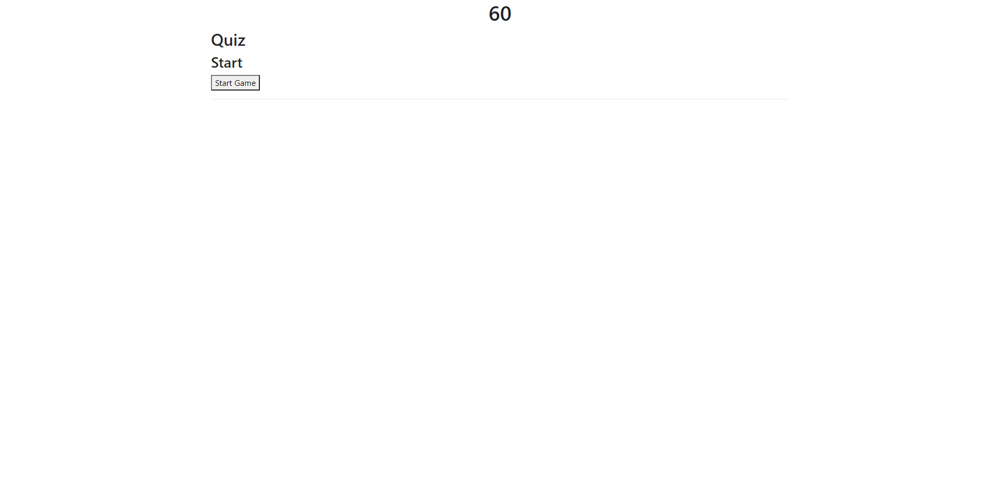
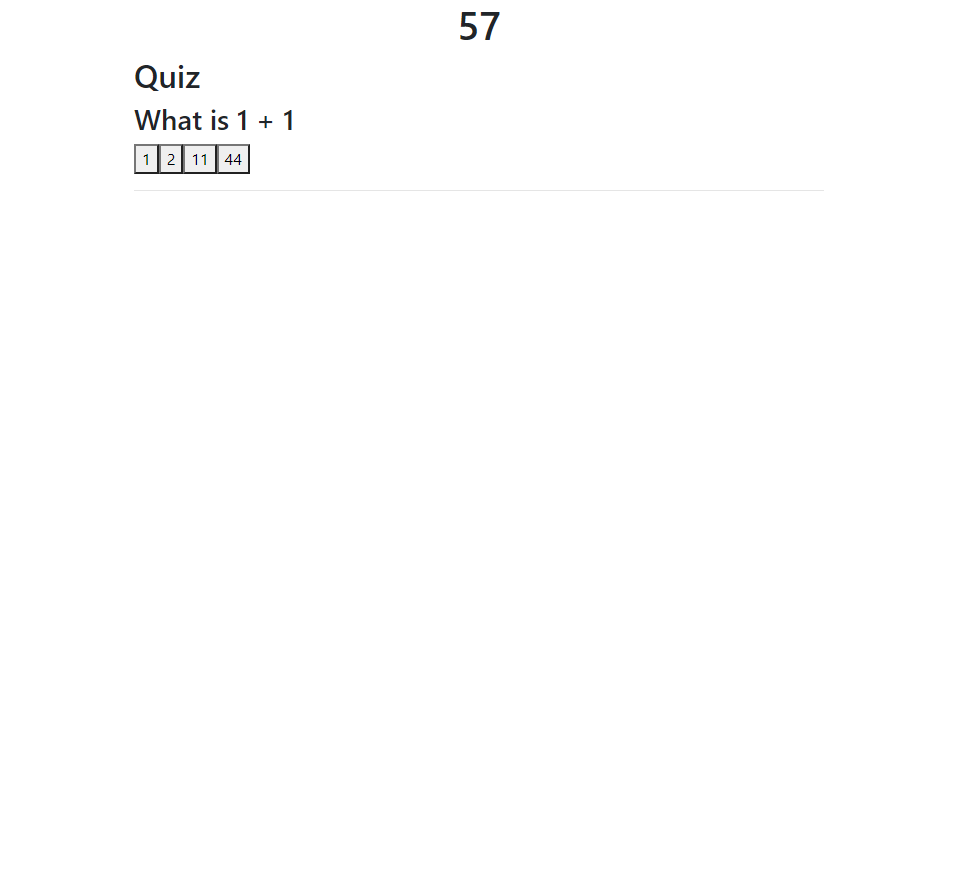
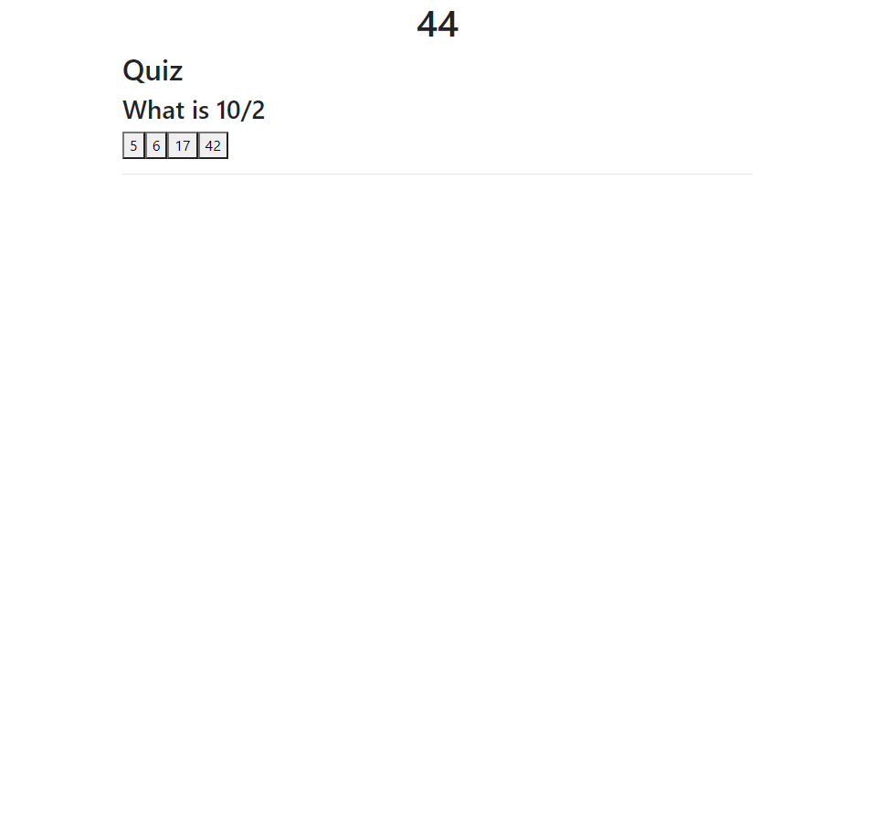
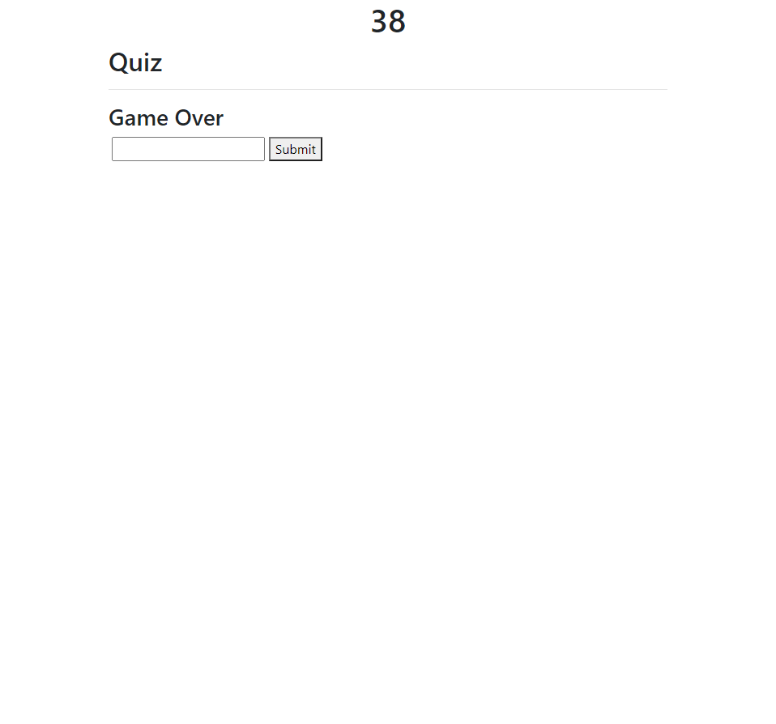

# JavaScript Quiz

I made this quiz to show the skills I have learned while writing JavaScript. The quiz is mainly for my portfolio and for future clients and employers.

https://davidayl.github.io/quiz/

## Table Of Contents

1. [About](#about)

2. [Key Components](#key-components)

3. [Reference Links](#reference-links)

4. [Visuals](#visuals)

## About

This page is about taking a quiz and having fun while doing it. The score is calculated by the time you have remaining when you finish the quiz. Each time you get a incorrect answer you are docked 10 seconds off the timer. The timer starts at 60 seconds when you being the quiz, the quiz will end when either all questions are answered or you run out of time.

## Key Components

    var questionsArray = [
    {
    text: "What is 1 + 1",
    choices: ["1", "2", "11", "44"],
    correct: "2",
     },
     {
    text: "What is 10/2",
    choices: ["5", "6", "17", "42"],
    correct: "5",
    },
    {
    text: "How many eggs in a dozen",
    choices: ["6", "2", "42", "12"],
    correct: "12",
     },

        This code block is defining our questions, answer choices and correct answer.

      for (i = 0; i < questionsArray[currentIndex].choices.length; i++) {
    var answerEl = document.createElement("button");
    answerEl.textContent = questionsArray[currentIndex].choices[i];

    answerEl.addEventListener("click", nextQuestion);

    mainEl.append(answerEl);

This loop is doing most of the work in the main section of the quiz. This loop will add the answer choices as well as add the questions on to the screen.

    function setTime() {

// Sets interval in variable
timerInterval = setInterval(function () {
secondsLeft--;
timeEl.textContent = secondsLeft;

    if (secondsLeft === 0) {
      // Stops execution of action at set interval
      clearInterval(timerInterval);
      // Calls function to send times up message
      sendMessage();
      endSection();
      }, 1000);

This code block is in charge of running the timer, it will send a message and take you to the end screen when time is up.

## Reference Links

https://www.w3schools.com/js/

JavaScript Introduction

https://developer.mozilla.org/en-US/docs/Web/JavaScript/Guide/Loops_and_iteration

Loops for JavaScript

## Visuals

